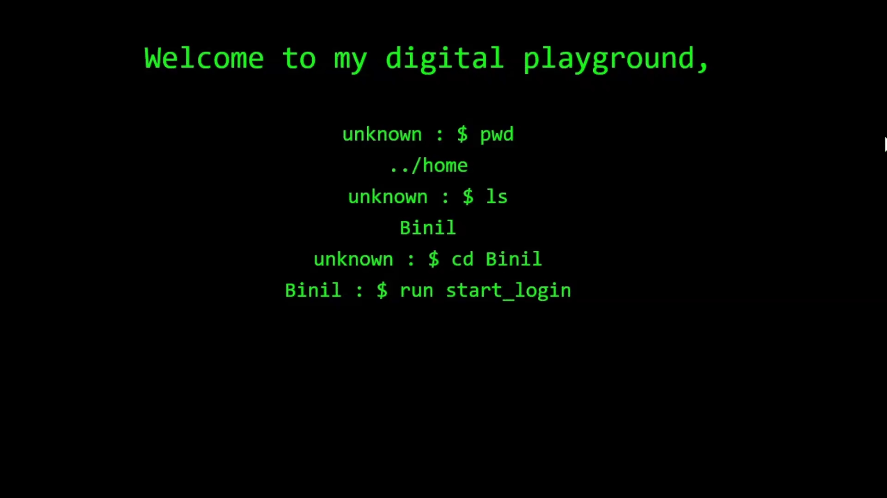

## 👋 Welcome to My GitHub Profile

<p align="center">
  <!-- Profile Views -->
 

  <!-- GitHub Followers -->
  

  <!-- GitHub Contributions -->
  

 <!-- GitHub Watchers -->


<!-- GitHub Issues -->


<!-- GitHub Pull Requests -->


<!-- GitHub Stars -->


<!-- GitHub Forks -->


</p>

<p align="center">
 
</p>

---

## 🚀 About Me

<p align="center">
  
</p>

<table style="font-family: Arial, sans-serif; font-size: 16px; font-weight: bold; color: white; text-align: left; border-collapse: collapse; width: 100%;">
  <tr>
    <td style="padding: 10px; vertical-align: middle; color: white;">
      <p style="margin: 5px 0;">🎓 <span style="color: white;">I’m currently a</span> <span style="color: #FFD700;">student</span>, <span style="color: white;">always eager to learn and grow!</span></p>
      <p style="margin: 5px 0;">🌱 <span style="color: white;">I’m currently learning</span> <span style="color: #00FF7F;">Blockchain, DevOps, and AI</span>.</p>
      <p style="margin: 5px 0;">💡 <span style="color: white;">I enjoy</span> <span style="color: #1E90FF;">solving real-world problems</span> <span style="color: white;">through technology.</span></p>
      <p style="margin: 5px 0;">⚡ <span style="color: white;">Fun fact: I love designing</span> <span style="color: #FF4500;">futuristic worlds</span> <span style="color: white;">and storytelling through animation.</span></p>
    </td>
    <td style="padding: 10px; text-align: center; vertical-align: middle;">
      
    </td>
  </tr>
</table>

---

## 📈 GitHub Stats & Contributions

<p align="center">
  
  <br><br>
 
</p>

---

### 📊 Languages Used

<p align="center">
  
</p>

---

## 🐍 Contribution Snake Animation

<p align="center">
  
</p>

---

## 📅 Commit Breakdown

```
🌞 Morning                766 commits         ████░░░░░░░░░░░░░░░░░░░░░   16.51 % 
🌤 Daytime                1865 commits        ██████████░░░░░░░░░░░░░░░   40.19 % 
🌙 Evening                1375 commits        ███████░░░░░░░░░░░░░░░░░░   29.63 % 
🌑 Night                  634 commits         ███░░░░░░░░░░░░░░░░░░░░░░   13.66 % 
```

---

## 📦 My GitHub Data

<table align="center" border="1" cellspacing="0" cellpadding="10">
    <tr>
        <th>🏆 GitHub Achievements</th>
        <th>📂 Storage Used</th>
        <th>🔓 Public Repositories</th>
        <th>🔒 Private Repositories</th>
    </tr>
    <tr>
        <td align="center">
            
        </td>
        <td align="center">
            
        </td>
        <td align="center">
            
        </td>
        <td align="center">
            
        </td>
    </tr>
</table>

---

## 🛠 Skills & Tools

<p align="center">
  
  
  
  
  
  
  
  
  
  
  
  
  
</p>

---

## 🌍 Connect with Me

<p align="center">
  <a href="https://www.linkedin.com/in/binil-vincent-b150aa187">
    
  </a>
  <a href="https://www.instagram.com/b__nil___thaz/">
    
  </a>
  <a href="https://youtube.com/@treasuretoons-5">
    
  </a>
  <a href="https://discord.gg/rVdFFxfG">
    
  </a>
</p>

---

## 🏆 GitHub Trophies  


---

## 🎵 Spotify Now Playing

<p align="center"> <a href="https://spotify-now-playing-widget.vercel.app/api/now-playing?theme=dark&scan=true&rainbow=true">  </a> </p>

---

## 🎭 Fun Animation

<p align="center">
  

---

### 🚀 Extras

<p align="center">
  <strong>🔹 Interests:</strong> AI | Blockchain | Cybersecurity | Animation | Storytelling <br>
  <strong>🎯 Hobbies:</strong> Coding | Writing | Exploring New Tech Trends | Gaming
</p>

<p align="center">
  
  
  
</p>


