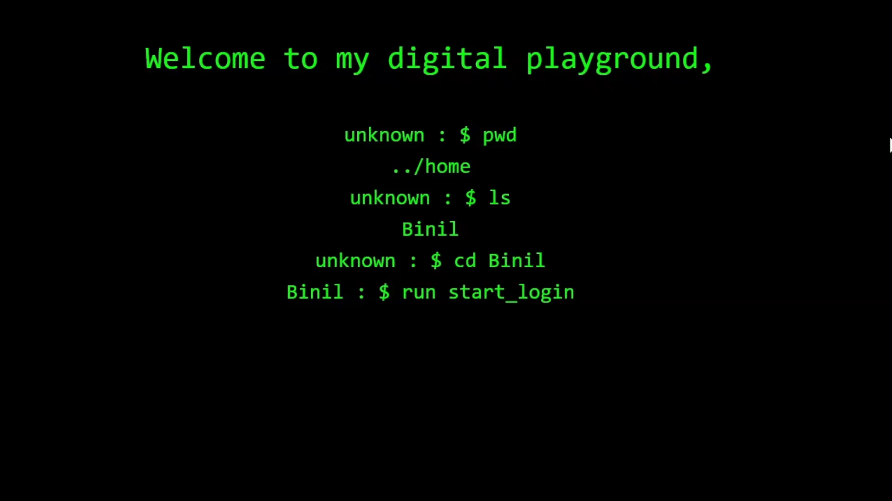

## 👋 Welcome to My GitHub Profile

  <!-- Profile Views -->
 

  <!-- GitHub Followers -->
  

  <!-- GitHub Contributions -->
  

  <!-- GitHub Watchers -->
  

  <!-- GitHub Issues -->
  

  <!-- GitHub Pull Requests -->
  

  <!-- GitHub Stars -->
  

  <!-- GitHub Forks -->
  

<!-- Portfolio Badge -->

  

  

---

 

---

## 🚀 About Me

  

<table style="font-family: Arial, sans-serif; font-size: 16px; font-weight: bold; color: white; text-align: left; border-collapse: collapse; width: 100%;">
  <tr>
    <td style="padding: 10px; vertical-align: middle; color: white;">
      
🎓 I’m currently a student, always eager to learn and grow!

      
🌱 I’m currently learning Blockchain, DevOps, and AI.

      
💡 I enjoy solving real-world problems through technology.

      
⚡ Fun fact: I love designing futuristic worlds and storytelling through animation.

    </td>
    <td style="padding: 10px; text-align: center; vertical-align: middle;">
      
    </td>
  </tr>
</table>

---

## 📈 GitHub Stats & Contributions

  
  

---

### 📊 Languages Used

  

---

## 🐍 Contribution Snake Animation

  

---

## 🦖 Contribution Dino Grid

  

---

## 📅 Commit Breakdown

<table>
  <tr>
    <th>Time of Day</th>
    <th>Commits</th>
    <th>Percentage</th>
    <th>Progress</th>
  </tr>
  <tr>
    <td>🌞 <b>Morning</b></td>
    <td><b>766</b></td>
    <td><b>16.51%</b></td>
    <td>█████░░░░░░░░ (16%)</td>
  </tr>
  <tr>
    <td>🌤 <b>Daytime</b></td>
    <td><b>1,865</b></td>
    <td><b>40.19%</b></td>
    <td>███████████░░░░ (40%)</td>
  </tr>
  <tr>
    <td>🌙 <b>Evening</b></td>
    <td><b>1,375</b></td>
    <td><b>29.63%</b></td>
    <td>█████████░░░░░░ (30%)</td>
  </tr>
  <tr>
    <td>🌑 <b>Night</b></td>
    <td><b>634</b></td>
    <td><b>13.66%</b></td>
    <td>███░░░░░░░░░░░ (14%)</td>
  </tr>
</table>

<h3>🔥 Total Commits: <b>4,640</b> 🚀</h3>

---

<!-- START:MY_GITHUB_DATA -->
## 📦 My GitHub Data

<table align="center" border="1" cellspacing="0" cellpadding="10">
    <tr>
        <th>🏆 GitHub Achievements</th>
        <th>📂 Storage Used</th>
        <th>🔓 Public Repositories</th>
        <th>🔒 Private Repositories</th>
    </tr>
    <tr>
        <td align="center">
            
        </td>
        <td align="center">
            
        </td>
        <td align="center">
            
        </td>
        <td align="center">
            
        </td>
    </tr>
</table>
<!-- END:MY_GITHUB_DATA -->

---

## 🚀 WakaTime Stats  

  

  

---

## 🌐 Developer Profiles

<h4 align="center">🏆 Competitive Programming & Coding Challenges</h4>

  &nbsp;
  &nbsp;
  &nbsp;
  &nbsp;
  &nbsp;
  &nbsp;
  &nbsp;
  &nbsp;
  &nbsp;
  

<h4 align="center">🛡️ Cybersecurity & CTF</h4>

  &nbsp;
  &nbsp;
  &nbsp;
  

<h4 align="center">☁️ Cloud & Enterprise</h4>

  &nbsp;
  &nbsp;
  &nbsp;
  

<h4 align="center">🎨 Frontend & Design</h4>

  &nbsp;
  

<h4 align="center">📊 Data Science & ML</h4>

  

<h4 align="center">🔗 Web3 & Blockchain</h4>

  &nbsp;
  

<h4 align="center">📚 Learning Platforms</h4>

  &nbsp;
  &nbsp;
  &nbsp;
  &nbsp;
  &nbsp;
  

<h4 align="center">🧩 Coding Practice</h4>

  

---
## 📚 Publications & Research

<table width="100%">
  <tr>
    <td>
      

        <h3>🧠 EEG-based Brain-Computer Interface (BCI) for Unmanned Aerial Vehicle (UAV) Control</h3>
        
<strong>Published in:</strong> <i>Global Perspectives on AI and Sustainable Development 2.0 (GPAISD 2.0)</i>

        

          
          
          
        

      

    </td>
  </tr>
</table>

---

## 📜 Certifications & Hackathons

<table width="100%">
  <tr align="center">
    <td width="33.3%">
      
    </td>
    <td width="33.3%">
      
    </td>
    <td width="33.3%">
      
    </td>
  </tr>
  <tr align="center">
    <td width="33.3%">
      
    </td>
    <td width="33.3%">
      
    </td>
    <td width="33.3%">
      
    </td>
  </tr>
  <tr align="center">
    <td width="33.3%">
      
    </td>
    <td width="33.3%">
      
    </td>
    <td width="33.3%">
      
    </td>
  </tr>
  <tr align="center">
    <td width="33.3%">
      
    </td>
    <td width="33.3%">
      
    </td>
    <td width="33.3%">
      
    </td>
  </tr>
</table>

---

## 🛠 Skills & Tools

### 💻 Languages

  
  
  
  
  
  

### 🚀 Frameworks & Libraries

  
  
  
  
  
  
  

### 🧠 AI / ML & Data Science

  
  
  
  
  
  
  

### 💾 Databases & Design

  
  
  

### ☁️ Cloud & DevOps

  
  
  
  
  

### 🛠️ Tools & Testing

  
  
  
  
  
  
  
  
  
  

---

## 🌍 Connect with Me

  
  
  
  

---

## 🏆 GitHub Trophies  

---

## 🎵 Spotify Now Playing

  

---

## 🎭 Fun Animation

  

---

## 🎯 Current Focus & Learning Path

<!-- START_TRENDS -->

  

### 🔍 Interactive Trend Explorer (Read at your own pace)

  Click on a trend below to expand and read details slowly. Hover over the slideshow above to pause it.

  
<b>1️⃣ Loop Engineering for Hierarchical Retrieval: Reading a Long Document by Its Table of Contents</b> &nbsp;|&nbsp; 🏷️ <i>Emerging Tech</i>

   
  <blockquote style="text-align: justify;">
    <b>Concept Overview:</b> Loop Engineering for Hierarchical Retrieval: Reading a Long Document by Its Table of Contents  Towards Data Science 
    <b>Implementation Use Case:</b> Applying Loop tools to modern development pipelines. 
    <b>Strategic Value:</b> Boosts system efficiency using new engineering frameworks. 
     🔗 <a href="https://news.google.com/rss/articles/CBMiwgFBVV95cUxNNFlHaldvRXhCN0w3blB4X2R2emhKeWUzQTZxN1BZRHdsMHltQ2luOHBSR0wxdTdRWURzSEFFMy1FSmJQY3dBaDduSWpaU3ZTY19qcUdtQjVQeFBwQTFfYlhHOE9Yd3VWUEVEMDhTYmVNdmRscXBsY1pWaTNGeGQtdXVpMFpnaGNmWEVZbkpQOEVpVTZzeU5ubllVY2ZPU2NNeUxwVUtFd3JrcVppYmVjY3JVYmRFXzdHQzJibEFIS0l0UQ?oc=5" target="_blank"><b>Read the full article on the market trends page</b></a>
  </blockquote>

  
<b>2️⃣ Slack Introduces Agent Driven End-to-End Testing to Improve Resilience in UI Test Automation</b> &nbsp;|&nbsp; 🏷️ <i>Artificial Intelligence</i>

   
  <blockquote style="text-align: justify;">
    <b>Concept Overview:</b> Slack Introduces Agent Driven End-to-End Testing to Improve Resilience in UI Test Automation: Agentic testing is an AI-driven approach to end-to-end test automation introduced by Slack engineering. It uses AI agents that execute workflows based on intent rather than fixed scripts, adapting to UI and system changes at runtime. The approach aims to reduce brittle tests in distributed systems while complementing deterministic unit, integration, and E2E testing strategies. By Leela Kumili 
    <b>Implementation Use Case:</b> Coordinating autonomous agent frameworks and context-aware systems. 
    <b>Strategic Value:</b> Reduces manual process complexity and automates multi-step pipelines. 
     🔗 <a href="https://www.infoq.com/news/2026/07/slack-agentic-e2e-testing-ui/?utm_campaign=infoq_content&amp;utm_source=infoq&amp;utm_medium=feed&amp;utm_term=AI%2C+ML+%26+Data+Engineering" target="_blank"><b>Read the full article on the market trends page</b></a>
  </blockquote>

  
<b>3️⃣ AWS Introduces Amazon S3 Annotations</b> &nbsp;|&nbsp; 🏷️ <i>Cloud & DevOps</i>

   
  <blockquote style="text-align: justify;">
    <b>Concept Overview:</b> AWS Introduces Amazon S3 Annotations: AWS recently announced Amazon S3 Annotations, a feature that lets teams attach rich, searchable context such as summaries, classifications, compliance data, or AI-generated insights directly to S3 objects. Annotations can be updated independently of the object and queried across datasets, reducing the need for separate metadata systems. By Renato Losio 
    <b>Implementation Use Case:</b> Configuring container clusters, multi-stage CI/CD pipelines, and serverless architectures. 
    <b>Strategic Value:</b> Reduces operational overhead and ensures automatic scalability under traffic. 
     🔗 <a href="https://www.infoq.com/news/2026/07/aws-s3-annotations/?utm_campaign=infoq_content&amp;utm_source=infoq&amp;utm_medium=feed&amp;utm_term=Architecture+%26+Design" target="_blank"><b>Read the full article on the market trends page</b></a>
  </blockquote>

<!-- END_TRENDS -->

---

<!-- START:NOT_FOLLOWING_BACK -->

## 📊 GitHub Follow Stats

| 👥 Followers | 👤 Following | 🚫 Not Following Back |
|:---:|:---:|:---:|
| **358** | **346** | **5** |

## 👀 People I Follow Who Don't Follow Me Back

_Last updated: 2026-07-12 03:17 UTC_

|   |   |   |   |   |
| :---: | :---: | :---: | :---: | :---: |
| [ **Aymane-001**](https://github.com/Aymane-001) | [ **bigmacman1129**](https://github.com/bigmacman1129) | [ **milad-hub**](https://github.com/milad-hub) | [ **Mustafakzlyy**](https://github.com/Mustafakzlyy) | [ **tejas-ae**](https://github.com/tejas-ae) |

**Total: 5**

<!-- END:NOT_FOLLOWING_BACK -->

---

### 🚀 Extras

  <strong>🔹 Interests : </strong> AI | Blockchain | Cybersecurity | Animation | Storytelling  
  <strong>🎯 Hobbies : </strong> Coding | Writing | Exploring New Tech Trends | Gaming

  
  
  

---

### ☕- Support 💸✨

