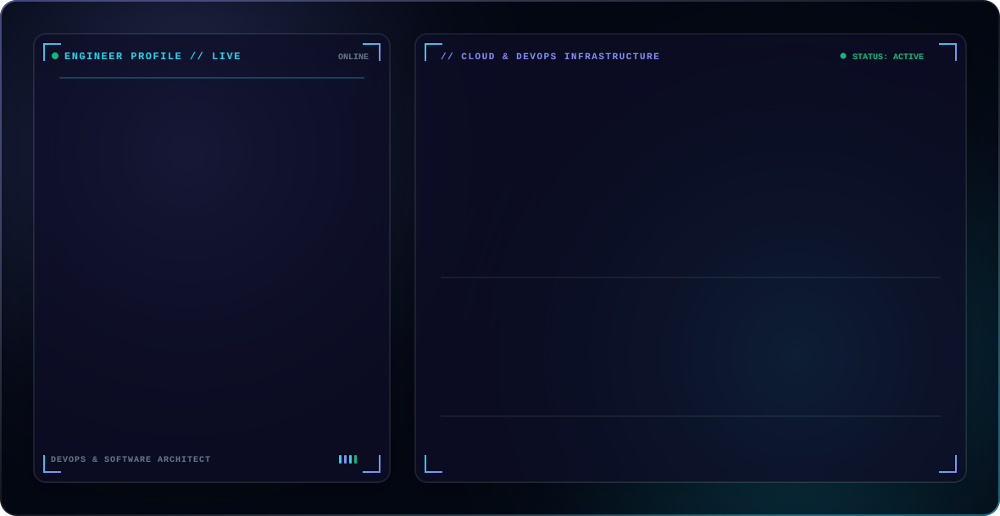

  <picture>
    <source media="(prefers-color-scheme: dark)" srcset="./dark.svg">
    <source media="(prefers-color-scheme: light)" srcset="./light.svg">
    
  </picture>

  &nbsp;
  &nbsp;
  &nbsp;
  

---

### 👨‍💻 Profile Overview

I am a **DevOps Engineer & Software Engineer** specializing in automated cloud infrastructure, container orchestration, robust CI/CD automation, and high-performance backend systems. I design resilient production architectures across AWS and Azure and develop scalable services with .NET Core, Python, and Node.js.

- 🎓 **Education**: **Master of Computer Applications (MCA)** & **Bachelor of Computer Applications (BCA)**.
- ⚙️ **Core Specification**: Cloud Infrastructure, Kubernetes Orchestration, CI/CD Automation & Full-Stack Engineering.
- 📍 **Location**: Kerala, India.
- 💼 **Primary Focus**: Automating cloud environments, streamlining continuous delivery, and full-stack system architecture.

---

### 🛠️ Technical Expertise & Tooling

#### ☁️ DevOps, Cloud & Observability *(Primary Specialization)*

  
  
  
  
  
  
  
  
  
  
  

#### 💻 Software Engineering & Frameworks

  
  
  
  
  
  
  

#### 💾 Databases & Storage

  
  
  

---

### 📚 Research & Publication

<table width="100%">
  <tr>
    <td>
      

        <h3>🧠 EEG-based Brain-Computer Interface (BCI) for Unmanned Aerial Vehicle (UAV) Control</h3>
        
<strong>Published in:</strong> <i>Global Perspectives on AI and Sustainable Development 2.0 (GPAISD 2.0)</i>

        

          
          
          
        

        
Investigation of direct neural telemetry and real-time EEG signal processing algorithms for navigational command of autonomous drone systems.

      

    </td>
  </tr>
</table>

---

### 📈 GitHub Analytics

  
  

  

  

<!-- START:MY_GITHUB_DATA -->
<table align="center" border="0" cellspacing="0" cellpadding="8">
    <tr align="center">
        <td></td>
        <td></td>
        <td></td>
        <td></td>
    </tr>
</table>
<!-- END:MY_GITHUB_DATA -->

---

### 📜 Certifications & Credentials

<table width="100%">
  <tr align="center">
    <td width="25%"></td>
    <td width="25%"></td>
    <td width="25%"></td>
    <td width="25%"></td>
  </tr>
  <tr align="center">
    <td width="25%"></td>
    <td width="25%"></td>
    <td width="25%"></td>
    <td width="25%"></td>
  </tr>
</table>

---

### 🎯 Tech Trends & Industry Watch

<!-- START_TRENDS -->

  

### 🔍 Interactive Trend Explorer (Read at your own pace)

  Click on a trend below to expand and read details slowly. Hover over the slideshow above to pause it.

  
<b>1️⃣ Presentation: Ontology‐Driven Observability: Building the E2E Knowledge Graph at Netflix Scale</b> &nbsp;|&nbsp; 🏷️ <i>Emerging Tech</i>

   
  <blockquote style="text-align: justify;">
    <b>Concept Overview:</b> Presentation: Ontology‐Driven Observability: Building the E2E Knowledge Graph at Netflix Scale: Prasanna Vijayanathan and Renzo Sanchez-Silva share how Netflix tackles observability across 38M events/sec. They discuss replacing reactive monitoring with an AI-driven operational ontology and agentic workflows using Claude and graph databases. They explain how unifying MELT telemetry into queryable knowledge graphs enables automated triaging, root-cause analysis, and self-healing systems. By Prasanna Vijayanathan, Renzo Sanchez-Silva 
    <b>Implementation Use Case:</b> Applying Presentation: tools to modern development pipelines. 
    <b>Strategic Value:</b> Boosts system efficiency using new engineering frameworks. 
     🔗 <a href="https://www.infoq.com/presentations/netflix-observability-aiops-ontology-scale/?utm_campaign=infoq_content&amp;utm_source=infoq&amp;utm_medium=feed&amp;utm_term=Architecture+%26+Design" target="_blank"><b>Read the full article on the market trends page</b></a>
  </blockquote>

  
<b>2️⃣ Grab Redesigns Counter Service Storage for 50% Lower P99 Latency</b> &nbsp;|&nbsp; 🏷️ <i>Emerging Tech</i>

   
  <blockquote style="text-align: justify;">
    <b>Concept Overview:</b> Grab Redesigns Counter Service Storage for 50% Lower P99 Latency: Grab migrated its high-volume Counter Service from a wide column database to Aerospike using storage abstraction, shadow traffic, data parity validation, and gradual traffic migration. The redesigned data model consolidated time buckets into map-based records. Grab reports about 50% lower production p99 read latency, 1 TB versus 3 TB of disk usage, and 45% to 50% lower cost per node. By Leela Kumili 
    <b>Implementation Use Case:</b> Applying Grab tools to modern development pipelines. 
    <b>Strategic Value:</b> Boosts system efficiency using new engineering frameworks. 
     🔗 <a href="https://www.infoq.com/news/2026/10/grab-counter-aerospike-migration/?utm_campaign=infoq_content&amp;utm_source=infoq&amp;utm_medium=feed&amp;utm_term=Architecture+%26+Design" target="_blank"><b>Read the full article on the market trends page</b></a>
  </blockquote>

  
<b>3️⃣ Margaret Hamilton, the woman who invented software engineering, has died</b> &nbsp;|&nbsp; 🏷️ <i>Emerging Tech</i>

   
  <blockquote style="text-align: justify;">
    <b>Concept Overview:</b> Margaret Hamilton, the woman who invented software engineering, has died  WQAD 
    <b>Implementation Use Case:</b> Applying Margaret tools to modern development pipelines. 
    <b>Strategic Value:</b> Boosts system efficiency using new engineering frameworks. 
     🔗 <a href="https://news.google.com/rss/articles/CBMi5wFBVV95cUxOZmNiMlAyWEhfV1JZWHgxOXNWNUxHNHpLcGZBQ2hqN1dPak1oLV9qRFZCUklTZEotOTBHSzlOMFBZRktsbV9jaEttUHBab2cxNldDNDJheEdmb3hUdXBJOEpib1RBdkNKMHVCWWhDX05icE0wanNUNnA0dGUycjN6aVVMaWhqa2daeHZYZ2RqRWgtLWVDYVltYlMzYy1kTEp4QUJsRVRHZXZWY0N5MDgzNVlpdGtoUWhRRWkyZGt3MFBSdVgteWRMYWQxOEV3TzVUOWg0QlpaZG1kZnBfY3kzbzhPaGVuVm8?oc=5" target="_blank"><b>Read the full article on the market trends page</b></a>
  </blockquote>

<!-- END_TRENDS -->

<!-- START:NOT_FOLLOWING_BACK -->
<!-- END:NOT_FOLLOWING_BACK -->

---

### 📬 Connect & Collaborate

  &nbsp;
  &nbsp;
  &nbsp;
  

  

